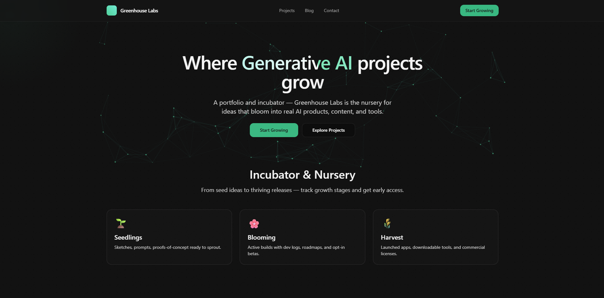

# Greenhouse Labs

**AI products, media tools, and custom software services built to launch.**

Greenhouse Labs is a product studio and software agency focused on practical AI apps, workflow automation, creator platforms, and broadcast/media tools. We build our own products, partner on custom software, and help teams turn rough internal tools into launchable offers.

[Visit the site](https://www.greenhouselabs.io) | [Explore products](https://www.greenhouselabs.io/products) | [View services](https://www.greenhouselabs.io/services) | [Start a project](https://www.greenhouselabs.io/contact)

## What We Build

- **AI product builds**: SaaS tools, internal platforms, RAG workflows, agentic assistants, data products, and production-ready AI UX.
- **Workflow automation**: Custom dashboards, task queues, process tools, Google/Slack/CRM integrations, and operational systems that reduce manual work.
- **Media and broadcast software**: Streaming products, NDI/audio utilities, creator platforms, live production workflows, and monetization systems.
- **Productization support**: MVP hardening, onboarding, licensing, purchase flows, documentation, and launch paths for tools that are ready to become offers.

## Portfolio Highlights

| Project | Focus | Status |
| --- | --- | --- |
| [Circuit](https://gocircuit.tv) | Creator streaming platform with live video, VOD, community features, and Base L2 payment rails | Live platform |
| [Privy AI](https://getprivy.io) | Privacy policy and terms analyzer that turns legal documents into plain-English risk insight | Live app |
| [NDI Audio Recorder](https://www.greenhouselabs.io/contact?interest=ndi-audio-recorder) | Professional NDI audio stream recording with monitoring, synchronization, and export tooling | Licensing soon |
| [AI Workflow Platform](https://www.greenhouselabs.io/projects/ai-workflow-platform) | Nine-module internal AI platform with secure RAG, proposal workflows, reporting, and operations tools | Custom build |
| [Steve Weed Media](https://steveweedmedia.com) | Live streaming, virtual event, aerial, and video production services in Colorado | Available |

## How We Work

Greenhouse Labs uses a simple product pipeline to match the work to the maturity of the idea:

1. **Seedlings**: Validate the shape with prototypes, workflow maps, prompt tests, and fast user feedback.
2. **Blooming**: Harden the system with real integrations, production UX, QA, and launch planning.
3. **Harvest**: Ship, document, license, measure, and improve products that are ready for the market.

The goal is not to make demos that look impressive for a week. The goal is to build tools that survive contact with real users, real workflows, and real operations.

## Ways to Work Together

- **Diagnostic Sprint**: Audit an app, workflow, or product idea and leave with a clear build plan.
- **Build Sprint**: Ship a focused feature, prototype, or internal tool for validation or adoption.
- **Product Build**: Design, implement, deploy, and launch a complete software product.
- **Productization Engagement**: Turn a half-built tool into a sellable product with positioning, onboarding, docs, and licensing.

## About This Site

This repository powers the Greenhouse Labs public website and portfolio. The site showcases products, services, case studies, and writing from the studio using a modern Next.js, TypeScript, Tailwind CSS, and MDX stack.

## Contact

Have a product to build, a workflow to automate, or a tool that is almost ready to launch?

[Book a build call](https://www.greenhouselabs.io/contact) or email [admin@greenhouselabs.io](mailto:admin@greenhouselabs.io).
